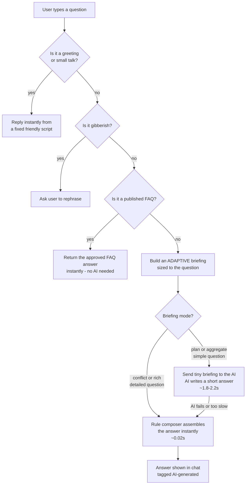

# FRM Genius — Chatbot Knowledge Transfer (KT)

> A plain-language guide to how the chatbot works, why part of it uses an AI model
> and part of it uses a rule-based composer, and how the two work together.
> Written so you can read it aloud in a presentation.

---

## 1. What is this chatbot?

The FRM Genius app has an assistant panel where the user (a Field Reimbursement
Manager) types questions like:

- *"What is the formulary tier for Meridian Choice PPO?"*
- *"How many plans cover Onvexa with no prior auth?"*
- *"Tell me about the Meridian Choice PPO conflict."*

The chatbot answers these questions using **live data** from the app's data
folder — payer changes, accounts, medical-policy rows, formulary rows,
notifications, materials, and audit trails. It never makes up an answer.

**The one big rule for this project:** every answer must arrive in about
**2 seconds or less**, and every fact in the answer must come from real data.

---

## 2. The two brains of the chatbot

The chatbot does not use one method for everything. It uses **two methods**,
and picks the right one for each question:

| | **The AI brain (LLM)** | **The rule brain (deterministic composer)** |
|---|---|---|
| What it is | A large language model (an AI that writes text) | Hand-written code that assembles answers from data |
| How it answers | Reads a small "briefing" of live data and writes its own sentences | Looks up the matching records and fills a fixed sentence pattern |
| Speed | ~1.8–2.2 seconds | ~0.01–0.02 seconds (instant) |
| Best at | Natural, human-sounding answers | Rich, detailed, multi-part answers |
| Weakness | Slow to write long answers; can be slow or fail | Sounds formulaic; only handles expected questions |

**Why not use only the AI?** Because of a hard limit we measured: the AI model
can *read* data very fast, but it *writes* very slowly — about 23 words per
second. A detailed answer (like a full conflict report) needs 60+ words of
output, which alone takes more than our 2-second budget. So for rich questions,
the AI would always time out. The rule brain answers those instantly.

**Why not use only rules?** Because rule-based answers sound robotic. For
simple questions ("what is the tier for X?"), a one-word natural answer from
the AI feels much better to the user.

So: **simple questions → AI writes the answer. Rich questions → rules
assemble the answer instantly.** Both read the same live data, so both are
always truthful.

---

## 3. How a question flows through the system



Step by step:

1. **Greeting / small talk check** — "hi", "help", "what's up" get a fixed
   friendly reply. No AI call, instant.
2. **Gibberish check** — random characters get a polite "please rephrase".
3. **FAQ fast-path** — if the question matches a published FAQ word-for-word,
   the approved FAQ answer is returned instantly. (Compliance-approved text
   must not be reworded by an AI.)
4. **Everything else** goes to the agent, which builds a briefing and picks
   the AI brain or the rule brain (Section 5).

---

## 4. The briefing: feeding live data to the AI

An AI model doesn't know anything about our payers or plans. Before asking it
to answer, we build a **briefing** — a small package of live data read from the
data folder at that very moment — and hand it to the AI with the question.
The AI is only allowed to answer from what's in the briefing.

The briefing is **adaptive**: it is sized to what the question needs.

- **Plan question** ("tier for Meridian Choice PPO?") → the briefing contains
  just that plan's medical-policy row and formulary row. Tiny.
- **Count question** ("how many plans cover…?") → the briefing contains
  pre-computed numbers (we count the rows in code, so the AI never has to).
- **Conflict / rich question** → the full detail is assembled by the rule
  composer instead (the AI can't write that much in time).

Code that builds the briefing (`lib/agentBriefing.ts`):

```ts
// The briefing is ADAPTIVE: sized to what the question needs, because the
// AI writes only ~23 tokens/s — it can compose an answer inside the 2.8s
// budget only when both the briefing and the expected answer are tiny.
const mode: BriefingMode = (() => {
  if (matchedConflicts.length > 0 && !wantsRawRows) return "conflict";
  if (broadQuestion) return "aggregate";
  if (includeSnapshots && (focusedMedPolicy.length > 0 || focusedFormulary.length > 0)) {
    return "plan";
  }
  if (matchedConflicts.length > 0) return "conflict";
  return "rich";
})();
```

A key detail: when the question names a full plan ("Meridian Choice PPO"),
we serialize **only that plan's rows** — not every plan the same payer owns.
This keeps the briefing tiny, which keeps the AI fast.

```ts
// Exact plan-name matches win: when the question contains a full plan or
// formulary name, serialize ONLY those rows — a token match would pull
// every plan the payer owns and blow the micro-briefing budget.
const MAX_FOCUS_ROWS = 8;
const exactMed = includeSnapshots
  ? medPolicy.filter((r) => qIncludes(r.plan_name.toLowerCase()))
  : [];
const focusedMedPolicy =
  exactMed.length > 0
    ? exactMed.slice(0, MAX_FOCUS_ROWS)
    : includeSnapshots
      ? medPolicy
          .filter((r) => rowMatchesQuestion(r.payer_name, r.plan_name))
          .slice(0, MAX_FOCUS_ROWS)
      : [];
```

---

## 5. Choosing the brain: the AI or the rules?

This is the heart of the design. The code that decides:

```ts
// app/api/assistant/route.ts
async function agentAnswer(question: string): Promise<string> {
  const briefing = buildAgentBriefing(question);
  // Rich questions (conflict detail, notifications, materials, audit):
  // a composed answer would need far more output than the 2.8s budget
  // allows, so the deterministic snapshot composer answers instantly
  // instead of burning 2.8s on a guaranteed timeout.
  if (briefing.mode === "conflict" || briefing.mode === "rich") {
    return buildSnapshotAnswer(question);
  }
  // Simple questions (one plan's rows, pre-computed counts): the AI
  // writes a short natural answer inside the budget.
  return llmChat(
    [
      { role: "system", content: briefing.systemPrompt },
      { role: "user", content: briefing.userPrompt },
    ],
    { maxTokens: 80, timeoutMs: 2_800 },
  );
}
```

In plain words:

- **"plan" or "aggregate" mode** → hand the tiny briefing to the AI, let it
  write a one-or-two-sentence answer. Feels natural, costs ~2 seconds.
- **"conflict" or "rich" mode** → skip the AI entirely. The rule composer
  reads the live records and assembles the full detailed answer in
  milliseconds.

### Why the AI gets a strict time limit

The AI call has a hard timeout of 2.8 seconds. If the AI is slow (server
busy, network hiccup), we don't wait — we fall back to the rule composer so
the user still gets a correct answer from live data. The user never sees an
error or an empty reply.

```ts
try {
  const answer = await agentAnswer(question);
  return Response.json({ answer });
} catch (error) {
  // AI failed or timed out — the rule composer still answers from live data.
  console.error("[assistant] LLM agent failed, using snapshot fallback:", ...);
  return Response.json({ answer: buildSnapshotAnswer(question) });
}
```

---

## 6. The rule composer (deterministic fallback)

The rule composer is a big set of "if the question is about X, answer with Y"
rules, all reading live data:

1. **A specific plan is named** → answer straight from that plan's
   medical-policy and formulary rows (coverage, prior auth, step therapy,
   tier, restrictions).
2. **A count question** ("how many plans cover…") → answer from
   pre-computed counts.
3. **A conflict is mentioned** → lead with the conflict record (what changed,
   from what to what, which offices are affected), then append the plan's
   current rows.
4. **Notifications / materials / accounts / audit trail / resolved /
   open conflicts** → each has its own rule and its own answer format.

Example of one rule, in code:

```ts
// 1. Specific plan asked about — answer straight from its live rows.
// When the question asks about a CONFLICT, conflict detail is the richer
// answer — lead with it and append the plan's policy/formulary rows.
const conflictIntent = /conflict|alert|issue|problem|change\b/.test(q);
if (planHit || formularyHit) {
  const parts: string[] = [];
  if (conflictIntent) {
    // ... conflict record first ...
  }
  if (planHit) {
    parts.push(
      `${planHit.payer_name} — ${planHit.plan_name} (${planHit.channel}, ` +
      `${Number(planHit.lives || 0).toLocaleString()} lives): coverage ` +
      `${planHit.coverage_status}, prior auth ... (medical policy as of ${planHit.as_of_date}).`,
    );
  }
  if (formularyHit) {
    parts.push(
      `Formulary: ${formularyHit.payer_name} — ${formularyHit.formulary_name} ` +
      `is ${formularyHit.formulary_status} on tier ${formularyHit.tier}, ...`,
    );
  }
  return parts.join(" ");
}
```

Every sentence it produces is built from real database values — nothing is
invented, and the "as of" dates come straight from the data.

---

## 7. Why this design wins (presentation summary)

If you only remember three things:

1. **Speed is a feature.** Users abandon slow assistants. We measured the AI
   gateway: it reads data fast but writes slowly (~23 words/sec), so we
   designed around that limit instead of hoping.
2. **Right tool for each question.** Simple questions get the AI's natural
   phrasing (~2s). Rich questions get the rule composer's instant, detailed
   answers (~0.02s). Both read the same live data.
3. **Never break, never lie.** If the AI is slow or fails, the rule composer
   answers from the same live data — the user always gets a correct answer
   within the time budget, and every fact is traceable to the database.

One-line version for a slide:

> **"Simple questions get AI-written answers in ~2 seconds; detailed questions
> get instantly assembled answers from live data; if the AI ever slows down,
> the same live data answers anyway."**

---

## 8. Where the code lives

| File | What it does |
|---|---|
| `app/api/assistant/route.ts` | The chatbot's front door: checks greetings/gibberish/FAQ, picks the AI or the rule composer, handles the fallback |
| `lib/agentBriefing.ts` | Builds the adaptive live-data briefing and decides the question's mode |
| `lib/llm.ts` | Talks to the AI gateway (with the strict time limit) |
| `lib/faq.ts` | The FAQ fast-path (approved answers, returned verbatim) |
| `data/` folder | The live data the chatbot reads (accounts, payer changes, policy rows, formulary rows, notifications, materials, audit events) |
| `features/assistant/` | The chat UI (message bubbles, "AI-generated" tag, retry chip) |
